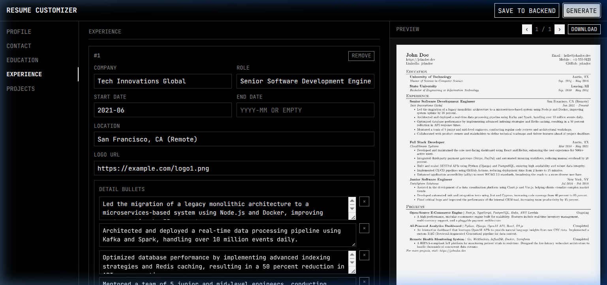

# Automated Resume Builder

Manage your professional profile via JSON and get a high-quality LaTeX resume PDF automatically. 

Two workflows available:
- **CI/CD (Zero Setup)**: Push to GitHub → PDF auto-generated. No local installation required.
- **Local Web UI (Power User)**: Edit JSON visually, preview PDF in real-time, generate on-demand with full local control.

[**📄 View Sample Resume**](https://github.com/jangwanAnkit/resume-builder/releases/download/latest/resume.pdf)

## Quick Start

### Option A: CI/CD Only (No Local Setup)
1. **Use as Template / Fork**: Click the **"Use this template"** button.
2. Edit JSON files in `data/`.
3. Push to `main` → GitHub Actions auto-generates PDF.
4. Download from [**Latest Release**](https://github.com/jangwanAnkit/resume-builder/releases/download/latest/resume.pdf).

### Option B: Local Web UI (Recommended for Power Users)
1. **Install Dependencies**:
   ```bash
   uv pip install -r requirements.txt
   ```
2. **Install TeX Live** (for PDF compilation):
   ```bash
   sudo apt install texlive-latex-base texlive-fonts-extra texlive-latex-extra
   ```
3. **Run the customizer**:
   ```bash
   uv run python customizer/server.py
   ```
4. Open [http://localhost:8000](http://localhost:8000).



## Features

- **Local Web UI**: A minimalist, built-in Customizer UI lets you edit JSON data effortlessly and preview the generated PDF in real-time.
- **AI-Tailored Resumes (Phase 1)**: The capability of the `resume-builder-tailor` agent is now available strictly inside the customizer backend. It connects to OpenAI, OpenRouter, Cerebras, and Gemini natively with BYOK (Bring Your Own Key) capability. View side-by-side red/green visual diffs and automatic JD relevance scoring.
- **JSON-based Source of Truth**: Manage all your data (profile, experience, education, skills, projects) in structured JSON files.
- **LaTeX Professionalism**: Utilizes a professional LaTeX template with Jinja2 rendering for a premium look.
- **Automated CI/CD**: GitHub Actions automatically compiles your LaTeX source into a PDF on every push to `main`.

## JSON Data Structure

The data files in `data/` directory:
- `profile.json`: Name, title, bio, and social links.
- `experience.json`: Professional work history.
- `education.json`: Academic background.
- `skills.json`: Categorized technical skills.
- `projects.json`: Highlighted projects.
- `contact.json`: Contact information and location.

## Local Command Line (Optional)

Generate LaTeX manually without the UI:
```bash
python scripts/render_resume.py
pdflatex resume.tex
```

## Accessing Your PDF (CI/CD)

Once you push to GitHub, the CI/CD pipeline auto-generates the PDF:
1.  Checking the [**Latest Release**](https://github.com/jangwanAnkit/resume-builder/releases/download/latest/resume.pdf) directly.
2.  Navigating to the **"Releases"** section on the right side of your GitHub repository.
3.  Downloading the `resume.pdf` asset from the **"Latest"** tag.
4. You can check the **"Actions"** tab to see the build progress and logs.
